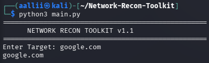
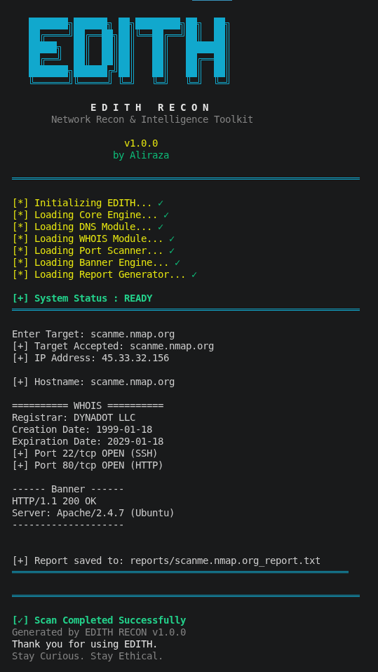
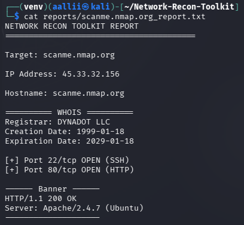

<div align="center">

# 🛡️ EDITH RECON

### Enhanced Digital Intelligence for Threat Hunting

*A Python-based Network Recon & Intelligence Toolkit for ethical reconnaissance and automated reporting.*


Developed with ❤️ by **Aliraza**

</div>
---
## 📊 Project Information

| Property | Value |
|----------|--------|
| Project Name | EDITH RECON |
| Version | v1.0.0 |
| Language | Python |
| Platform | Kali Linux |
| Development Status | Stable |
| License | MIT |

---

# 📖 About the Project

EDITH RECON is a Python-based command-line reconnaissance toolkit developed to automate the initial phase of network information gathering during ethical security assessments.

The toolkit performs essential reconnaissance tasks such as DNS resolution, Reverse DNS lookup, WHOIS information gathering, TCP port scanning, HTTP banner grabbing, and automated report generation.

The primary objective of this project is to strengthen networking fundamentals, Python socket programming, and ethical reconnaissance techniques while following a modular software design.

---

# 🎯 Project Objectives

- Automate basic network reconnaissance
- Collect important information about a target domain
- Generate structured scan reports
- Practice Python socket programming
- Improve networking fundamentals
- Learn ethical information gathering
- Build a professional cybersecurity portfolio project

---

# ✨ Features

| Feature | Description |
|----------|-------------|
| 🌐 DNS Lookup | Resolves a domain name to its IP address |
| 🔄 Reverse DNS Lookup | Retrieves the hostname from an IP address |
| 📄 WHOIS Lookup | Collects domain registration details |
| 🚪 TCP Port Scanner | Detects open ports on the target |
| 📡 HTTP Banner Grabbing | Identifies web server information |
| 📑 Report Generator | Saves scan results into a structured report |
| 🎨 Professional CLI | Clean terminal interface with EDITH branding |
| ⚡ Loading Animation | Professional startup experience |

---

# 💡 Why EDITH RECON?

Reconnaissance is the first phase of every penetration test.

Before testing a system, security professionals gather information such as:

- Domain Information
- IP Address
- Open Ports
- Running Services
- Server Information

EDITH RECON automates this process and presents the collected information in a clean, readable format.

---

# 🛠️ Technologies Used

| Technology | Purpose |
|------------|---------|
| Python 3 | Core Programming Language |
| socket | DNS Resolution & Port Scanning |
| python-whois | WHOIS Information |
| requests | HTTP Banner Grabbing |
| colorama | Colored Terminal Interface |
| Git | Version Control |
| GitHub | Repository Hosting |
| Kali Linux | Development Environment |

---

# 🏗️ Project Architecture

```text
                    +----------------------+
                    |      User Input      |
                    +----------+-----------+
                               |
                               v
                    +----------------------+
                    |     EDITH RECON      |
                    +----------+-----------+
                               |
      +------------+-----------+-----------+-------------+
      |            |                       |             |
      v            v                       v             v
+-----------+ +-----------+         +-------------+ +--------------+
| DNS Lookup| | Reverse   |         | WHOIS Lookup| | Port Scanner |
|           | | DNS       |         |             | |              |
+-----------+ +-----------+         +-------------+ +--------------+
                                                   |
                                                   v
                                         +----------------------+
                                         | HTTP Banner Grabber  |
                                         +----------+-----------+
                                                    |
                                                    v
                                         +----------------------+
                                         | Report Generator     |
                                         +----------+-----------+
                                                    |
                                                    v
                                         +----------------------+
                                         | Scan Report (.txt)   |
                                         +----------------------+
```

---

# 🔄 Project Workflow

```text
Start
   │
   ▼
Display EDITH Banner
   │
   ▼
Enter Target Domain
   │
   ▼
Resolve IP Address
   │
   ▼
Reverse DNS Lookup
   │
   ▼
WHOIS Information
   │
   ▼
Port Scan
   │
   ▼
HTTP Banner Grabbing
   │
   ▼
Generate Report
   │
   ▼
Display Results
   │
   ▼
End
```

---

# 📂 Folder Structure

```text
EDITH-Recon/
│
├── docs/
│
├── modules/
│
├── reports/
│
├── screenshots/
│
├── .gitignore
├── banner.py
├── main.py
├── README.md
└── requirements.txt
```
---

# 💭 Design Decisions

EDITH RECON follows a modular architecture to keep the project clean, scalable, and easy to maintain.

### Why Modular Design?

Instead of placing all the logic inside a single file, the project separates responsibilities into different components. This improves readability and allows future features to be added without changing the existing workflow.

### Design Choices

- **main.py**
  - Controls the complete reconnaissance workflow.
  - Handles user input and coordinates each scanning module.

- **banner.py**
  - Displays the EDITH branding.
  - Handles startup animation and terminal footer.

- **modules/**
  - Reserved for future reconnaissance modules.
  - Keeps the project scalable as new features are added.

- **reports/**
  - Stores generated scan reports separately from the source code.
  - Makes report management easier.

- **screenshots/**
  - Stores screenshots used inside the GitHub documentation.

### Benefits

- Better code organization
- Easier debugging
- Simple maintenance
- Easy feature expansion
- Professional project structure

---
# 📦 Requirements

Before running EDITH RECON, make sure the following requirements are installed on your system.

| Requirement | Version |
|------------|---------|
| Python | 3.10 or later |
| Git | Latest |
| Internet Connection | Required |
| Operating System | Kali Linux (Recommended) |


---

# ⚙️ Installation

Clone the repository

```bash
git clone https://github.com/aallii7086/EDITH-Recon.git
```

Move into the project

```bash
cd EDITH-Recon
```

Create a virtual environment

```bash
python3 -m venv venv
```

Activate the environment

```bash
source venv/bin/activate
```

Install dependencies

```bash
pip install -r requirements.txt
```

Run EDITH RECON

```bash
python3 main.py
```

---

# ▶️ Example Usage

```bash
python3 main.py
```

Example:

```text
$ python3 main.py

==========================================
        EDITH RECON v1.0
==========================================

Enter Target Domain: example.com

[✓] Resolving DNS...
[✓] Reverse DNS Lookup...
[✓] WHOIS Lookup...
[✓] Port Scan...
[✓] HTTP Banner...

------------------------------------------
Report Generated Successfully
Saved to: reports/example.com_report.txt
------------------------------------------
```

During execution, EDITH RECON automatically performs:

- DNS Resolution
- Reverse DNS Lookup
- WHOIS Lookup
- TCP Port Scan
- HTTP Banner Grabbing
- Report Generation

---

# 📸 Screenshots

### 🚀 Startup Screen



---

### 🖥️ Scan Output



---

### 📄 Generated Report



---

# 📚 Key Learning Outcomes

Building EDITH RECON helped strengthen my understanding of:

- Python Programming
- Socket Programming
- DNS Resolution
- Reverse DNS Lookup
- WHOIS Enumeration
- TCP Port Scanning
- HTTP Communication
- Report Generation
- Exception Handling
- Git & GitHub Workflow
- Modular Software Design

---

# 🧠 Skills Demonstrated

- Python
- Linux
- Networking Fundamentals
- Socket Programming
- DNS & WHOIS Enumeration
- TCP Port Scanning
- HTTP Banner Grabbing
- Report Automation
- Git Version Control
- GitHub
- CLI Application Development
- Software Documentation

---

# 🚀 Future Improvements

Future versions of EDITH RECON may include:

- Multi-threaded Port Scanning
- Custom Port Range Selection
- JSON Report Export
- CSV Report Export
- CLI Arguments using `argparse`
- Better Service Detection
- Progress Bar for Long Scans
- Improved Error Handling
- IPv6 Support

---

# 👨‍💻 Author

**Aliraza**

Cybersecurity Enthusiast • Python Developer • Aspiring Junior Web Pentester

GitHub: https://github.com/aallii7086

---

# ⭐ Support

If you found this project useful, consider giving it a ⭐ on GitHub.

Feedback and suggestions are always welcome.

---